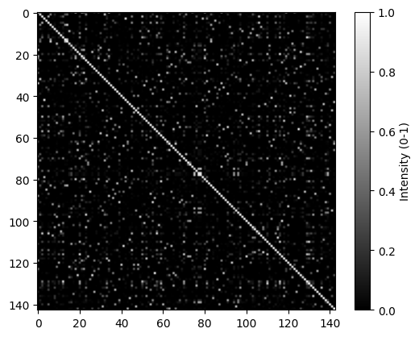

## Overview

Given a scene mesh and images with poses, this code calculates the covisibility between images and extract covisible pairs.

## Prerequisites
- torch
- pytorch3d
- etc

## Installation
```
conda env create --file environment.yml
```

## Usage
```
python main.py --data_dir ~/Dataset/stanford2d3d/area_4 --mesh_path 3d/rgb_dec.ply --output_dir area_4_output --debug_output_dir area_4_output_debug --num_nn 2,3,4
```

## Supported Datasets
- Currently only Standford2D3D dataset is supported.


## Example Results

- output_dir/pair_info.txt: knn covisibility information
- output_dir/pairs_{k}.txt: covisible pairs with k-closest pairs
- debug_output_dir/heatmap.png: heatmap visualization of correlation matrix
- debug_output_dir/covisibility_result.txt: knn covisibility information (slightly mmore detailed than pair_info.txt)
- debug_output_dir/pairs : containing sample near/far pair images.

**pairs_{k}.txt**
```
...
pano/rgb/camera_b77c4bc70fee437eb83de08ecd7cae32_hallway_3_frame_equirectangular_domain_rgb.png pano/rgb/camera_662b1aaa2cce48739739acd28165bd48_hallway_3_frame_equirectangular_domain_rgb.png
pano/rgb/camera_b77c4bc70fee437eb83de08ecd7cae32_hallway_3_frame_equirectangular_domain_rgb.png pano/rgb/camera_807bde44379c46328d098e065b7bdea6_hallway_3_frame_equirectangular_domain_rgb.png
pano/rgb/camera_177606c1f69c4a318f8c78af0ec4fc9d_office_3_frame_equirectangular_domain_rgb.png pano/rgb/camera_f26e8c1a5f774c599fa703484545160e_office_3_frame_equirectangular_domain_rgb.png
pano/rgb/camera_177606c1f69c4a318f8c78af0ec4fc9d_office_3_frame_equirectangular_domain_rgb.png pano/rgb/camera_56f7a8ec9a974fc2970a473d31dbe46b_hallway_10_frame_equirectangular_domain_rgb.png
pano/rgb/camera_33a07f405c2a4b6aba268f29f6f7573d_hallway_9_frame_equirectangular_domain_rgb.png 
...
```

**pair_info.txt**
```
...
a09c960763364750a3f26f5f1933542d_office_5 8b3143db40fc4e02b9575cc959251a8d_office_5 0.6541 4
052d9c44bad049c58382ea47d1544851_hallway_14 f943173446e44d5d88ce451240b99fa5_hallway_7 0.5421 4
108d4df9dbe74b5e93a4a82948350b37_office_1 4b6982edad14499bbc5cb606f85242f3_hallway_10 0.2729 4
8b3143db40fc4e02b9575cc959251a8d_office_5 db3c1b4ae68e4a54a257069051ad2ed0_office_5 0.4769 2
8b3143db40fc4e02b9575cc959251a8d_office_5 3b29ab5b5a634918a95390a7b7fae817_office_5 0.4347 4
2be505b7d9d54bec97c472ede6612db7_office_2 5d14d5c9d0844f18b45718c5443f5af3_hallway_10 0.3881 4
1de9948ba1ac4ffe9adb4a390fc3fdd1_storage_4 a00880cdfbbb443db3fc7738f1ea830f_lobby_1 0.4104 3
1de9948ba1ac4ffe9adb4a390fc3fdd1_storage_4 32457ecb37b04506977cf0dcbb2cb52f_hallway_1 0.2595 4
a00880cdfbbb443db3fc7738f1ea830f_lobby_1 c5f7d30033764fb59d2a742912cc6e19_lobby_1 0.6440 2
a00880cdfbbb443db3fc7738f1ea830f_lobby_1 c8a999a5832f493ebe38dd6479ae49b3_lobby_1 0.5467 3
a00880cdfbbb443db3fc7738f1ea830f_lobby_1 6bf4b82c22264ccc9611efe1c1ff5e62_lobby_1 0.4923 4
ae9532af8fd548fea3e6b5b62d57a518_hallway_7 b456557453fe474d9480a30349804060_hallway_12 0.5286 3
ae9532af8fd548fea3e6b5b62d57a518_hallway_7 2869db404dd24a5e9a0ddd2e619fd224_hallway_12 0.4393 4
...
```

**heatmap.png**


